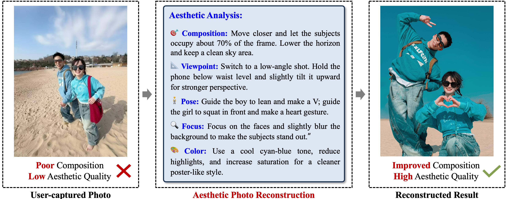
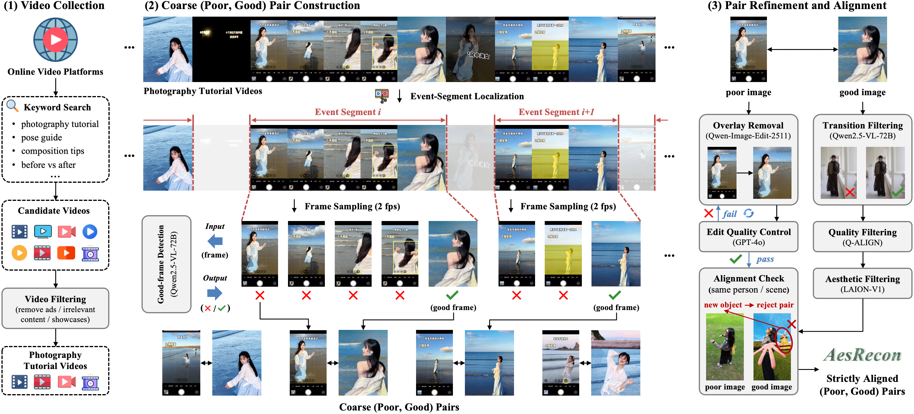
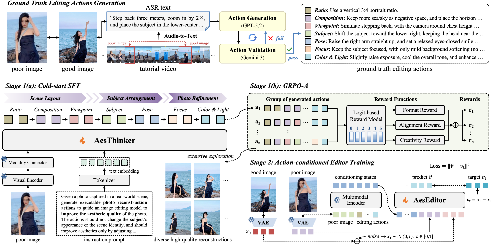

<!-- PROJECT LOGO -->

<p align="center">
  <h1 align="center">AesFormer: Transform Everyday Photos into Beautiful Memories</h1>
  <p align="center">
    <a href="http://39.108.48.32/mipl/news/news.php?id=EGdutianxiang"><strong>Tianxiang Du</strong></a>
    ·
    <a href="http://39.108.48.32/mipl/news/news.php?id=EGhehulingxiao"><strong>Hulingxiao He</strong></a>
    ·
    <a href="http://39.108.48.32/mipl/yuxinpeng/"><strong>Yuxin Peng</strong></a>
  </p>
  <h2 align="center">ICML 2026</h2>
  <h3 align="center"><a href="https://arxiv.org/abs/2605.22126">Paper</a></h3>
<div align="center"></div>

## 🌟 **Motivation**
Modern photo enhancement tools can brighten images, retouch faces, or apply filters, but they often fail to fix structural flaws introduced during shooting. To address this, we introduce **Aesthetic Photo Reconstruction (APR)**, a new task that improves photo aesthetics by reconstructing composition, viewpoint, and subject poses while preserving identity and scene semantics. It pushes AI-based photo editing from surface-level retouching to structure-level visual reconstruction.

<div align="center">

</div>

## 📖 **Dataset**
We propose a video-based corpus mining pipeline (**VCMP**) to mine APR data from photography tutorial videos. Using this pipeline, we construct **AesRecon**, an APR dataset and benchmark containing 9,071 poor–good image pairs.

<div align="center">

</div>

## 🧩 **Method**
We introduce **AesFormer**, a two-stage framework for APR. In Stage 1, **AesThinker** learns to generate executable editing actions across seven progressive photographic dimensions. It is first initialized via SFT on actions distilled from tutorial videos, and further trained with **GRPO-A** to encourage diverse aesthetic action planning. In Stage 2, **AesEditor** reconstructs the photo by executing the predicted actions through structural edits.

<div align="center">

</div>


## 📣 News
- [05/26/2026] We release <a href="https://huggingface.co/popo28/AesFormer">AesFormer</a>, along with the AesRecon dataset and training code.
- [05/01/2026] Our work has been accepted to <a href="https://icml.cc/Conferences/2026">ICML 2026</a> 🌼 See you in Seoul this July!

## 💾 Installation

Clone this repository and move to the project working directory:
```
git clone https://github.com/PKU-ICST-MIPL/AesFormer_ICML2026.git
cd AesFormer_ICML2026
```

## 📦 Datasets Preparation
To download AesRecon, please sign the [Release Agreement](agreement/Release_Agreement.pdf) and send it to Tianxiang Du (tianxiangdu28@163.com). By sending the application, you are agreeing and acknowledging that you have read and understand the notice. We will reply with the file and the corresponding guidelines right after we receive your request!

After downloading, unzip and organize the directory like the following and we are ready to go:
```
AesRecon_dataset
├── images
│   ├── good_images/
│   └── poor_images/
└── jsons
    ├── train
    │   ├── Stage1_a/
    │   ├── Stage1_b/
    │   └── Stage2/
    └── test/
```


## 🔥 Training
#### Stage 1(a): Cold-start SFT

1\. Create the working environment
```
conda create -n AesThinker_SFT python=3.10 -y
conda activate AesThinker_SFT
```

2\. Clone and install [LlamaFactory](https://github.com/hiyouga/LlamaFactory)
```
git clone --depth 1 https://github.com/hiyouga/LlamaFactory.git
cd LlamaFactory
pip install -e .
pip install -r requirements/metrics.txt
```

3\. Download the backbone model 
Download [Qwen3-VL-8B-Instruct](https://huggingface.co/Qwen/Qwen3-VL-8B-Instruct) from HuggingFace:
```
huggingface-cli download Qwen/Qwen3-VL-8B-Instruct --local-dir AesFormer_ICML2026/pretrained_weights
```
After downloading, the directory should be organized as follows:
```
AesFormer_ICML2026
    └── pretrained_weights/
          └── Qwen3-VL-8B-Instruct
```

4\. Train AesFormer with cold-start SFT
Before training, configure the AesRecon dataset following the requirements of [LLaMAFactory](https://github.com/hiyouga/LlamaFactory). 

Specifically, add the AesRecon dataset entry to `AesFormer_ICML2026/LLaMA-Factory/data/dataset_info.json`, and make sure the `dataset` field in `train_Stage1_a.yaml` matches the dataset name in `dataset_info.json`.

Copy the Stage 1(a) training configuration to the LLaMAFactory training directory:
```
cp AesFormer_ICML2026/train/Stage1_a/train_Stage1_a.yaml AesFormer_ICML2026/LLaMA-Factory/examples/train_lora
```

Then launch training:
```
cd AesFormer_ICML2026/LLaMA-Factory
llamafactory-cli train examples/train_lora/train_Stage1_a.yaml
```
For detailed configuration, please refer to [LLaMAFactory](https://github.com/hiyouga/LlamaFactory).

#### Stage 1(b): GRPO-A
1\. Create the working environment
```
conda create -n AesThinker_GRPO-A python=3.10 -y
conda activate AesThinker_GRPO-A
```

2\. Clone and install [EasyR1](https://github.com/hiyouga/easyr1)
```
git clone https://github.com/hiyouga/EasyR1.git
cd EasyR1
pip install -e .
```

3\. Download the reward model 
Download [Qwen2.5-VL-32B-Instruct](https://huggingface.co/Qwen/Qwen2.5-VL-32B-Instruct) from HuggingFace:
```
huggingface-cli download Qwen/Qwen2.5-VL-32B-Instruct --local-dir AesFormer_ICML2026/pretrained_weights
```
After downloading, the directory should be organized as follows:
```
AesFormer_ICML2026
└── pretrained_weights/
    └── Qwen2.5-VL-32B-Instruct/
```

4\. Start the reward server
Before training Stage 1(b), start the GRPO-A reward server. The environment setup for the reward server can refer to [Edit-R1](https://github.com/PKU-YuanGroup/Edit-R1).
```
cd AesFormer_ICML2026/train/Stage1_b
python GRPO-A_reward_server.py
```

5\. Train AesFormer with GRPO-A
Copy the Stage 1(b) training script to the EasyR1 example directory:
```
cp AesFormer_ICML2026/train/Stage1_b/train_Stage1_b.sh AesFormer_ICML2026/EasyR1/examples
cp AesFormer_ICML2026/train/Stage1_b/train_Stage1_b.yaml AesFormer_ICML2026/EasyR1/examples
```

Copy the GRPO-A reward function to the EasyR1 reward function directory:
```
cp AesFormer_ICML2026/train/Stage1_b/GRPO-A_reward_function.py AesFormer_ICML2026/EasyR1/examples/reward_function
```

Then launch training:
```
cd AesFormer_ICML2026/EasyR1
bash examples/train_Stage1_b.sh
```
**Note:** FlashAttention is disabled during Stage 1(b) training. For detailed configuration, please refer to [EasyR1](https://github.com/hiyouga/EasyR1).


#### Stage 2: Action-conditioned Editor Training
1\. Create the working environment
```
conda create -n AesEditor python=3.10 -y
conda activate AesEditor
```

2\. Clone and install [musubi-tuner](https://github.com/kohya-ss/musubi-tuner) 
```
git clone https://github.com/kohya-ss/musubi-tuner.git
cd musubi-tuner
pip install -e .
```

3\. Download the pretrained editor weights 
Please follow the official instructions of [musubi-tuner](https://github.com/kohya-ss/musubi-tuner/blob/main/docs/qwen_image.md) to download the pretrained weights of Qwen-Image-Edit-2511. 

The required weights mainly include three components: VAE, Text Encoder, and DiT. Please place them under `AesFormer_ICML2026/pretrained_weights/`.

4\. Train AesEditor
Run the Stage 2 training scripts:
```
cd AesFormer_ICML2026/train/Stage2/bash
bash 1_cache_latents.sh
bash 2_cache_textencoder.sh
bash 3_train_lora.sh
```
For detailed configuration, please refer to [musubi-tuner](https://github.com/kohya-ss/musubi-tuner).


## 📋 Evaluation
Step 1: Run AesThinker inference
```
cd AesFormer_ICML2026/test/Stage1
python Aesthetic_Planning.py
```

Step 2: Run AesEditor inference
```
cd AesFormer_ICML2026/test/Stage2
python Aesthetic_Editing.py
```

Step 3: Evaluate aesthetic quality
We use three aesthetic assessment models for evaluation: ArtiMuse, LAION-V2, and Q-Align. Please configure the required environment for each model before running the evaluation scripts.
```
cd AesFormer_ICML2026/test/Stage2/evaluate
python ArtiMuse.py
python LAION-V2.py
python Q-align.py
python final_score_summary.py
```

**Note.** For the GPT-4o win-rate evaluation, we initially used the gpt-4o service provided by gpt.zhizengzeng.com. We later found that this service may not be stably mapped to a fixed backend model, and that the mapping can change over time, which affects evaluation results. Even when the model outputs remained unchanged, the evaluation results could still vary. We observed similar issues in other projects as well. Therefore, we have stopped using this platform and will adopt more transparent APIs with explicitly versioned model snapshots in future evaluations.


## 🚩 Acknowledgments
Our code references [LlamaFactory](https://github.com/hiyouga/LlamaFactory), [EasyR1](https://github.com/hiyouga/easyr1), [musubi-tuner](https://github.com/kohya-ss/musubi-tuner), [Edit-R1](https://github.com/PKU-YuanGroup/Edit-R1). Many thanks to the authors.

## 🗻 Citation
Should you find our paper valuable to your work, we would greatly appreciate it if you could cite it:
```bibtex
@article{du2026aesformer,
  title={AesFormer: Transform Everyday Photos into Beautiful Memories},
  author={Du, Tianxiang and He, Hulingxiao and Peng, Yuxin},
  journal={arXiv preprint arXiv:2605.22126},
  year={2026}
}
```
